<div align="center">

# 🚀 Hi, I'm **Akarashak Mishra** 


[](https://github.com/Akarshak51)
[](https://github.com/Akarshak51?tab=followers)
[](https://github.com/Akarshak51?tab=repositories)
[](https://github.com/Akarshak51)
[](https://github.com/Akarshak51)
[](https://github.com/Akarshak51)


</div>

---

## 🌌 About Me

```python
class Akarashak:
    def __init__(self):
        self.name = "Akarashak Mishra"
        self.location = "Prayagraj, India 🇮🇳"
        self.role = "AI Engineer & Full Stack Developer"
        self.education = "B.Tech in Computer Science"
        self.interests = ["AI/ML", "Web Development", "Automation", "Open Source"]
        self.motto = "Explore. Build. Solve. Repeat."
        
    def current_focus(self):
        return {
            "🧠 AI/ML": ["LLMs", "Computer Vision", "Neural Networks"],
            "🌐 Web Dev": ["React", "Next.js", "Three.js", "FastAPI"],
            "☁️ Cloud": ["AWS", "Docker", "Kubernetes"],
            "🎨 Design": ["3D Graphics", "UI/UX", "Interactive Experiences"]
        }
    
    def life_philosophy(self):
        return "Code is poetry, AI is the future, and learning never stops 🚀"
    
    def available_for(self):
        return ["Collaboration", "Innovation", "Freelance Projects", "Open Source"]

# Initialize
developer = Akarashak()
print(f"Current Mission: {developer.life_philosophy()}")
```

<div align="center">

### 🎯 Quick Facts

```ascii
╔══════════════════════════════════════════════════════════════╗
║  💼 Role: AI Engineer & Full Stack Developer                 ║
║  🎓 Education: B.Tech in Computer Science                    ║
║  🌍 Location: Prayagraj, India                               ║
║  💡 Experience: 3+ Years in Software Development             ║
║  🏆 Projects: 50+ Repositories | 20+ Open Source Contributions║
║  ⚡ Fun Fact: I debug with console.log and I'm proud of it! ║
╚══════════════════════════════════════════════════════════════╝
```

</div>

---

## 🎯 Current Stats & Activities

<div align="center">

### 📊 GitHub Analytics


</div>

<div align="center">


</div>

<div align="center">


</div>

### 📈 Contribution Graph

[](https://github.com/Akarshak51)

### 📈 3D Contribution Graph

<div align="center">


</div>

---

## 💻 Tech Stack & Expertise

<div align="center">

### 🚀 Skills Radar

```ascii
        System Design
             ⭐⭐⭐⭐⭐
                 |
                 |
AI/ML ⭐⭐⭐⭐⭐---------⭐⭐⭐⭐⭐ Full Stack
                 |
                 |
             ⭐⭐⭐⭐⭐
          Cloud & DevOps
```

</div>

<details open>
<summary><b>🎯 Core Technologies</b></summary>
<br>

### Programming Languages

<div align="center">


</div>

### Frameworks & Libraries

<div align="center">

#### Frontend Development


#### Backend Development


</div>

</details>

<details open>
<summary><b>🤖 AI/ML & Data Science</b></summary>
<br>

<div align="center">

### Machine Learning & Deep Learning


### Data Science & Analytics


### Computer Vision & NLP


</div>

</details>

<details open>
<summary><b>☁️ Cloud & DevOps</b></summary>
<br>

<div align="center">

### Cloud Platforms


### DevOps & Tools


</div>

</details>

<details open>
<summary><b>🗄️ Databases & Storage</b></summary>
<br>

<div align="center">

### Relational Databases


### NoSQL Databases


### Vector Databases


</div>

</details>

<details open>
<summary><b>🛠️ Development Tools</b></summary>
<br>

<div align="center">

### Version Control & Collaboration


### IDEs & Editors


### API & Testing


### Design & Prototyping


</div>

</details>

<details open>
<summary><b>🎨 Additional Skills</b></summary>
<br>

<div align="center">

### Web Technologies


### Architecture & Patterns


### Other Technologies


</div>

</details>

<div align="center">

### 📊 Skill Proficiency

```ascii
╔═══════════════════════════════════════════════════════════════╗
║  Python        ████████████████████░ 95%  🐍                  ║
║  JavaScript    ██████████████████░░ 90%  🟨                   ║
║  TypeScript    ████████████████░░░░ 85%  🔷                   ║
║  React         ██████████████████░░ 90%  ⚛️                   ║
║  AI/ML         █████████████████░░░ 88%  🤖                   ║
║  FastAPI       ████████████████░░░░ 85%  ⚡                   ║
║  Docker        ███████████████░░░░░ 82%  🐳                   ║
║  AWS           ██████████████░░░░░░ 78%  ☁️                   ║
║  Three.js      ███████████████░░░░░ 80%  🎨                   ║
║  System Design █████████████████░░░ 87%  🏗️                   ║
╚═══════════════════════════════════════════════════════════════╝
```

</div>

---

## 🌟 Featured Projects & Contributions

<div align="center">

### 🏆 Project Showcase

| 🎯 Project | 📝 Description | 🛠️ Tech Stack | ⭐ Stars | 🔗 Links |
|-----------|---------------|---------------|---------|---------|
| [**problem-finder-app**](https://github.com/Akarshak51/problem-finder-app) | AI-powered problem navigator with immersive 3D UI |    |  | [Demo](https://github.com/Akarshak51/problem-finder-app) |
| [**EEG-Fatigue-Detection**](https://github.com/Akarshak51/EEG-Fatigue-Detection-System) | Real-time EEG-based fatigue monitoring system |    |  | [Demo](https://github.com/Akarshak51/EEG-Fatigue-Detection-System) |
| [**personal-ai-agent**](https://github.com/Akarshak51/personal-ai-agent) | Custom intelligent agent with LangChain |    |  | [Demo](https://github.com/Akarshak51/personal-ai-agent) |
| [**YOLO-Object-Detection**](https://github.com/Akarshak51/YOLO-Object-Detection-Voice) | Voice-enabled computer vision for accessibility |    |  | [Demo](https://github.com/Akarshak51/YOLO-Object-Detection-Voice) |

</div>

<details open>
<summary><b>💡 Project Highlights & Features</b></summary>

### 🎯 problem-finder-app
```javascript
const features = {
  ui: "Interactive 3D environment with Three.js",
  ai: "Intelligent problem-solving navigation",
  design: "Responsive & cross-platform compatible",
  community: "Open-source with active contributors",
  impact: "Helping users find solutions through immersive UX"
};
```

### 🧠 EEG-Fatigue-Detection
```python
features = {
    "realtime": "Live fatigue monitoring & alerts",
    "websocket": "Real-time data streaming",
    "backend": "High-performance FastAPI server",
    "ml": "Advanced prediction models",
    "impact": "Workplace safety & health monitoring"
}
```

### 🤖 personal-ai-agent
```python
features = {
    "workflow": "Custom AI agent workflows",
    "integration": "LangChain & OpenAI powered",
    "memory": "Context-aware conversations",
    "architecture": "Extensible & modular design",
    "impact": "Democratizing AI automation"
}
```

### 👁️ YOLO-Object-Detection
```python
features = {
    "cv": "Real-time object detection",
    "accessibility": "Voice-enabled for visually impaired",
    "performance": "Optimized YOLO implementation",
    "impact": "Making computer vision accessible"
}
```

</details>

<div align="center">

### 🎨 Project Categories

```ascii
    📱 Web Apps        🤖 AI/ML Projects    🎮 Interactive
        ↓                    ↓                  ↓
    ┌─────────┐       ┌──────────┐       ┌──────────┐
    │ React   │       │ TensorFlow│      │ Three.js │
    │ Next.js │       │ PyTorch   │      │ WebGL    │
    │ FastAPI │       │ LangChain │      │ Canvas   │
    └─────────┘       └──────────┘       └──────────┘
         │                  │                  │
         └──────────────────┴──────────────────┘
                            ↓
                   🚀 Full Stack Projects
```

</div>

---

## 📚 What I'm Currently Learning & Exploring

```mermaid
graph TB
    A[🧠 Learning Journey 2025] --> B[Advanced AI/ML]
    A --> C[Cloud Architecture]
    A --> D[System Design]
    A --> E[3D Graphics & WebGPU]
    
    B --> B1[Large Language Models]
    B --> B2[Reinforcement Learning]
    B --> B3[Neural Architecture Search]
    
    C --> C1[Kubernetes & Orchestration]
    C --> C2[Microservices Architecture]
    C --> C3[Serverless Computing]
    
    D --> D1[Distributed Systems]
    D --> D2[Scalability Patterns]
    D --> D3[Performance Optimization]
    
    E --> E1[Advanced Three.js]
    E --> E2[Shader Programming]
    E --> E3[Real-time Rendering]
    
    style A fill:#A177F7,stroke:#F85D7F,stroke-width:3px
    style B fill:#F85D7F,stroke:#F8D866,stroke-width:2px
    style C fill:#F8D866,stroke:#A177F7,stroke-width:2px
    style D fill:#61DAFB,stroke:#F85D7F,stroke-width:2px
    style E fill:#FF6F00,stroke:#F8D866,stroke-width:2px
```

<div align="center">



</div>

<div align="center">

### 📖 Currently Reading & Learning

```ascii
╔════════════════════════════════════════════════════════════╗
║  📚 Books & Resources                                      ║
╠════════════════════════════════════════════════════════════╣
║  🔹 Designing Data-Intensive Applications                 ║
║  🔹 Deep Learning by Ian Goodfellow                       ║
║  🔹 System Design Interview by Alex Xu                    ║
║  🔹 Microservices Patterns by Chris Richardson            ║
║  🔹 WebGPU Best Practices & Graphics Programming          ║
╚════════════════════════════════════════════════════════════╝
```

### 🎓 Courses & Certifications


</div>

---

## 🏆 Achievements, Contributions & Recognition

<div align="center">

### 🎯 GitHub Achievements

[](https://github.com/Akarshak51)
[](https://github.com/Akarshak51)
[](https://github.com/Akarshak51)
[](https://github.com/Akarshak51)
[](https://github.com/Akarshak51)

</div>

<div align="center">

```ascii
┌────────────────────── 🏆 Milestones ──────────────────────┐
│                                                            │
│  ✅ 50+ Public Repositories                               │
│  ✅ 100+ Total Commits This Year                          │
│  ✅ 20+ Open Source Contributions                         │
│  ✅ 10+ Collaborative Projects                            │
│  ✅ 5+ Featured Projects with 10+ Stars Each              │
│                                                            │
└────────────────────────────────────────────────────────────┘
```

### 🌟 Key Highlights

```python
achievements = {
    "💻 Code": {
        "total_commits": "500+",
        "lines_of_code": "50,000+",
        "projects_completed": "30+",
        "languages_used": "10+"
    },
    "🤝 Community": {
        "open_source_contributions": "20+",
        "code_reviews": "50+",
        "mentored_developers": "5+",
        "blog_posts": "Coming Soon!"
    },
    "🚀 Impact": {
        "users_helped": "100+",
        "github_stars_received": "50+",
        "forks": "30+",
        "collaborators": "15+"
    }
}
```

</div>

<details>
<summary><b>🎖️ Badges & Certifications</b></summary>
<br>

<div align="center">


</div>

</details>

---

## 📊 Detailed Analytics & Metrics

<div align="center">

### ⚡ Coding Activity

<!--START_SECTION:waka-->
```text
Python       12 hrs 30 mins  ████████████░░░░░░░░░  52.3%
JavaScript   6 hrs 15 mins   ██████░░░░░░░░░░░░░░░  26.1%
TypeScript   2 hrs 45 mins   ███░░░░░░░░░░░░░░░░░░  11.5%
HTML/CSS     1 hr 30 mins    █░░░░░░░░░░░░░░░░░░░░   6.3%
Other        55 mins         █░░░░░░░░░░░░░░░░░░░░   3.8%
```
<!--END_SECTION:waka-->

### 📈 Contribution Heatmap

[](https://github.com/Akarshak51)

### 🎯 Repository Analytics


</div>

<div align="center">

### 📅 Weekly Development Breakdown

```ascii
Monday     ████████████░░░░░░░░  12 commits
Tuesday    ███████████████░░░░░  15 commits
Wednesday  ██████████░░░░░░░░░░  10 commits
Thursday   ████████████████░░░░  16 commits
Friday     ███████████████████░  19 commits
Saturday   ████████░░░░░░░░░░░░   8 commits
Sunday     ██████░░░░░░░░░░░░░░   6 commits
```

</div>

---

## 🎵 Spotify Now Playing

<div align="center">

[](https://open.spotify.com/user/yourspotifyusername)

### 🎧 Coding Soundtrack

```ascii
♪ ♫ ┌──────────────────────────────────┐ ♪ ♫
♪ ♪ │  Currently Playing:              │ ♪ ♪
    │  🎵 Lo-Fi Beats for Coding       │
    │  🎵 Synthwave Vibes               │
    │  🎵 Ambient Electronic            │
    └──────────────────────────────────┘
    ▶━━━━━━━━━━━━━━●────── 2:34 / 3:45
```

</div>

---

## 💬 Connect & Collaborate

<div align="center">

### 🌐 Find Me On

[](https://portfolio-9i59-5f77szldq-mishra46er-7701s-projects.vercel.app/)
[](https://www.linkedin.com/in/akarashak-mishra-5a0013250)
[](https://github.com/Akarshak51)
[](https://twitter.com/yourhandle)
[](mailto:akarashak.mishra@example.com)
[](https://dev.to/yourhandle)
[](https://medium.com/@yourhandle)
[](https://stackoverflow.com/users/yourid)

### 📬 Let's Collaborate!

```ascii
╔══════════════════════════════════════════════════════════╗
║  💼 Open for:                                            ║
║  ✅ Freelance Projects                                   ║
║  ✅ Open Source Collaboration                            ║
║  ✅ Full-time Opportunities                              ║
║  ✅ Technical Consulting                                 ║
║  ✅ Mentorship & Knowledge Sharing                       ║
╚══════════════════════════════════════════════════════════╝
```

### 💡 Got an Idea? Let's Build It Together!

<a href="mailto:akarashak.mishra@example.com">
  
</a>

</div>

---

## 💭 Random Dev Quote & Wisdom

<div align="center">


### 📜 My Favorite Quotes

```ascii
┌────────────────────────────────────────────────────────┐
│  "The best way to predict the future is to invent it." │
│                                        - Alan Kay       │
│                                                        │
│  "Code is like humor. When you have to explain it,    │
│   it's bad."                                          │
│                                        - Cory House    │
└────────────────────────────────────────────────────────┘
```

</div>

---

## 🎮 Fun Zone

<div align="center">

### 🎯 Current Status

```javascript
const myLife = {
  code: "Always",
  eat: "Sometimes",
  sleep: "Maybe",
  repeat: "Definitely"
};

console.log(`Life.status: ${JSON.stringify(myLife)}`);
// Output: Life.status: {"code":"Always","eat":"Sometimes","sleep":"Maybe","repeat":"Definitely"}
```

### ☕ Coffee Counter

```ascii
  ☕ Coffees consumed this week: ████████████████░░░░  42/50
  
  ( (
   ) )
  ........ 
  |      |] "Fueled by coffee and curiosity"
  \      /  
   `----'
```

### 🎲 Fun Facts About Me

```python
fun_facts = [
    "🌙 I code better at night (peak productivity: 11 PM - 3 AM)",
    "🎮 Gamer by night, coder by choice",
    "🍕 Pizza is my debugging food",
    "🎸 I can play 3 chords on the guitar (and use them in every song)",
    "🚀 Space enthusiast - one day I'll code for Mars missions!",
    "📚 I have 50+ browser tabs open right now (and I know what each one is for)",
    "🤖 I talk to AI more than humans (they're better listeners)",
    "☕ My code-to-coffee ratio is 100:1"
]

for fact in fun_facts:
    print(fact)
```

</div>

---

## 📈 2025 Goals & Progress

<div align="center">

```ascii
╔═══════════════════════ 🎯 2025 GOALS ══════════════════════╗
║                                                             ║
║  📚 Learn                                                   ║
║     [████████████████████░░░░░]  80%  New Technologies    ║
║     [██████████████░░░░░░░░░░░]  60%  System Design       ║
║                                                             ║
║  💼 Build                                                   ║
║     [██████████████████████░░░]  90%  Side Projects        ║
║     [████████████████░░░░░░░░░]  70%  Open Source          ║
║                                                             ║
║  🤝 Contribute                                              ║
║     [████████████████████████░]  95%  GitHub Contributions ║
║     [██████████████████░░░░░░░]  75%  Community Help       ║
║                                                             ║
║  📝 Write                                                   ║
║     [████████░░░░░░░░░░░░░░░░░]  40%  Technical Blogs      ║
║     [██████░░░░░░░░░░░░░░░░░░░]  30%  Documentation        ║
║                                                             ║
╚═════════════════════════════════════════════════════════════╝
```

### 🎯 Monthly Goals

| Month | Goal | Status | Progress |
|-------|------|--------|----------|
| January | Master Kubernetes | ✅ | 100% |
| February | Build 3 AI Projects | ✅ | 100% |
| March | Contribute to 10 OSS | ✅ | 100% |
| April | Learn System Design | ✅ | 100% |
| May | Create Portfolio V2 | ✅ | 100% |
| June | Master Three.js | ✅ | 100% |
| July | AWS Certification | ✅ | 100% |
| August | Build SaaS Product | ✅ | 100% |
| September | 100 Commits | ✅ | 100% |
| October | Tech Blog Series | ✅ | 100% |
| November | Advanced ML Projects | 🔄 | 75% |
| December | Year Review & Plan | ⏳ | 0% |

</div>

---

## 🎨 GitHub Snake Animation

<div align="center">


</div>

---

## 💖 Support My Work

<div align="center">

If you like my projects and want to support my work, consider:

[](https://buymeacoffee.com/yourhandle)
[](https://paypal.me/yourhandle)
[](https://github.com/sponsors/Akarshak51)

```ascii
╔═══════════════════════════════════════════════════════╗
║  Every star ⭐ and contribution makes a difference!   ║
║  Thank you for your support! 🙏                       ║
╚═══════════════════════════════════════════════════════╝
```

</div>

---

<div align="center">

## 🌈 Thanks for Visiting My Profile! 


### 💡 "Code is poetry, AI is the future, and learning never stops!"


---

### 📊 Profile Views & Visitor Count


### 🎯 Let's Connect & Collaborate

```ascii
  ____                  _   _                 
 / ___|___  _ __  _ __ | \ | | _____      __ 
| |   / _ \| '_ \| '_ \|  \| |/ _ \ \ /\ / / 
| |__| (_) | | | | | | | |\  | (_) \ V  V /  
 \____\___/|_| |_|_| |_|_| \_|\___/ \_/\_/   
                                              
```

<table>
  <tr>
    <td align="center">
      
      <br>
      <sub><b>Wave Hello!</b></sub>
    </td>
    <td align="center">
      
      <br>
      <sub><b>Follow Me!</b></sub>
    </td>
    <td align="center">
      
      <br>
      <sub><b>Star Repos!</b></sub>
    </td>
    <td align="center">
      
      <br>
      <sub><b>Collaborate!</b></sub>
    </td>
  </tr>
</table>

---

### 🚀 Quick Links

<div align="center">

| Resource | Link |
|----------|------|
| 📂 All Projects | [View Repositories](https://github.com/Akarshak51?tab=repositories) |
| ⭐ Starred Repos | [My Stars](https://github.com/Akarshak51?tab=stars) |
| 📝 Gists | [Code Snippets](https://gist.github.com/Akarshak51) |
| 🎯 Pinned Projects | [Featured Work](https://github.com/Akarshak51#featured-projects--contributions) |

</div>

---

### 🎨 GitHub Metrics

<div align="center">


</div>

---

### 📚 Latest Blog Posts & Articles

<div align="center">

<!-- BLOG-POST-LIST:START -->
📝 Coming Soon! Stay tuned for technical articles, tutorials, and insights...
<!-- BLOG-POST-LIST:END -->

```ascii
┌─────────────────────────────────────────┐
│  📖 Upcoming Blog Topics:               │
│  • Building Scalable AI Applications    │
│  • Three.js: Creating 3D Web Experiences│
│  • FastAPI Best Practices               │
│  • Microservices Architecture Guide     │
│  • Machine Learning in Production       │
└─────────────────────────────────────────┘
```

</div>

---

### 🎓 Resources I Recommend

<details>
<summary><b>📚 Learning Resources</b></summary>
<br>

**For Beginners:**
- [FreeCodeCamp](https://www.freecodecamp.org/) - Web Development
- [Codecademy](https://www.codecademy.com/) - Interactive Learning
- [The Odin Project](https://www.theodinproject.com/) - Full Stack
- [CS50](https://cs50.harvard.edu/) - Computer Science Fundamentals

**For AI/ML:**
- [Fast.ai](https://www.fast.ai/) - Practical Deep Learning
- [DeepLearning.AI](https://www.deeplearning.ai/) - Andrew Ng's Courses
- [Google ML Crash Course](https://developers.google.com/machine-learning/crash-course)
- [Kaggle Learn](https://www.kaggle.com/learn) - Hands-on ML

**For System Design:**
- [System Design Primer](https://github.com/donnemartin/system-design-primer)
- [Designing Data-Intensive Applications](https://dataintensive.net/)
- [ByteByteGo](https://bytebytego.com/) - Visual Learning

</details>

<details>
<summary><b>🛠️ Useful Tools & Extensions</b></summary>
<br>

**VS Code Extensions:**
- GitHub Copilot
- Prettier - Code Formatter
- ESLint
- GitLens
- Thunder Client
- Error Lens

**Productivity Tools:**
- [Notion](https://www.notion.so/) - Note Taking
- [Postman](https://www.postman.com/) - API Testing
- [Figma](https://www.figma.com/) - Design
- [Excalidraw](https://excalidraw.com/) - Diagrams

</details>

---

### 🎮 GitHub Achievements

<div align="center">


</div>

---

### 💬 Testimonials & Feedback

<div align="center">

```ascii
╔══════════════════════════════════════════════════════════╗
║  "Akarshak is an exceptional developer with a passion    ║
║   for AI and creating innovative solutions."             ║
║                                        - Colleague        ║
╠══════════════════════════════════════════════════════════╣
║  "His work on the problem-finder-app shows incredible    ║
║   attention to detail and user experience."              ║
║                                        - Open Source User ║
╠══════════════════════════════════════════════════════════╣
║  "Always willing to help and share knowledge with        ║
║   the developer community."                              ║
║                                        - GitHub Community ║
╚══════════════════════════════════════════════════════════╝
```

</div>

---

### 🏅 Badges & Certifications Collection

<div align="center">


</div>

---

### 🌍 Global Reach

<div align="center">

```ascii
      🌏 Connecting Developers Worldwide 🌎
      
  Asia    Europe   Americas   Africa   Oceania
   🏢      🏰       🗽        🦁       🦘
   ↓       ↓        ↓         ↓        ↓
  ═══════════════════════════════════════
         Building the Future Together
  ═══════════════════════════════════════
```

**Collaboration Timezone:** UTC+5:30 (IST)  
**Available for:** Remote Opportunities Worldwide

</div>

---

### 🔔 Stay Updated

<div align="center">

[](https://github.com/Akarshak51)
[](https://github.com/Akarshak51.atom)

**Get notified about:**
- 🚀 New project releases
- 📝 Blog post publications
- 🎯 Major updates & features
- 💡 Open source contributions

</div>

---

### 📅 Availability Calendar

<div align="center">

```ascii
╔════════════════════════════════════════════╗
║  📆 Current Availability: OPEN             ║
╠════════════════════════════════════════════╣
║  Mon-Fri: Available for meetings           ║
║  Weekends: Focused development time        ║
║  Response Time: Within 24 hours            ║
║  Time Zone: IST (UTC+5:30)                 ║
╚════════════════════════════════════════════╝
```

</div>

---

### 🎊 Special Thanks

<div align="center">

```markdown
A huge thank you to:
- 🌟 All my GitHub followers and supporters
- 🤝 Open source contributors and collaborators
- 💡 The amazing developer community
- 🚀 Everyone who has starred, forked, or used my projects
- 📚 Mentors and peers who inspire me daily

You all make this journey worthwhile! 🙏
```

</div>

---

### 📜 License

<div align="center">

Most of my projects are licensed under the MIT License.  
Feel free to use, modify, and distribute with attribution.

[](https://opensource.org/licenses/MIT)

</div>

---

### 🎯 Final Thoughts

<div align="center">

```python
class FinalMessage:
    def __init__(self):
        self.message = "Thank you for visiting my profile!"
        self.hope = "I hope you found something interesting"
        self.invitation = "Let's connect and build amazing things together"
        
    def call_to_action(self):
        return """
        🌟 Star my repositories if you find them useful
        🍴 Fork and contribute to open source
        📬 Reach out for collaboration opportunities
        💬 Let's connect and share knowledge
        🚀 Keep coding, keep learning, keep growing!
        """

message = FinalMessage()
print(message.call_to_action())
```

---


---

</div>

<div align="center">

**[⬆ Back to Top](#-hi-im-akarashak-mishra)**

---


<sub>⭐️ From [Akarshak51](https://github.com/Akarshak51) with 💜 | Last Updated: November 2025</sub>

</div>
